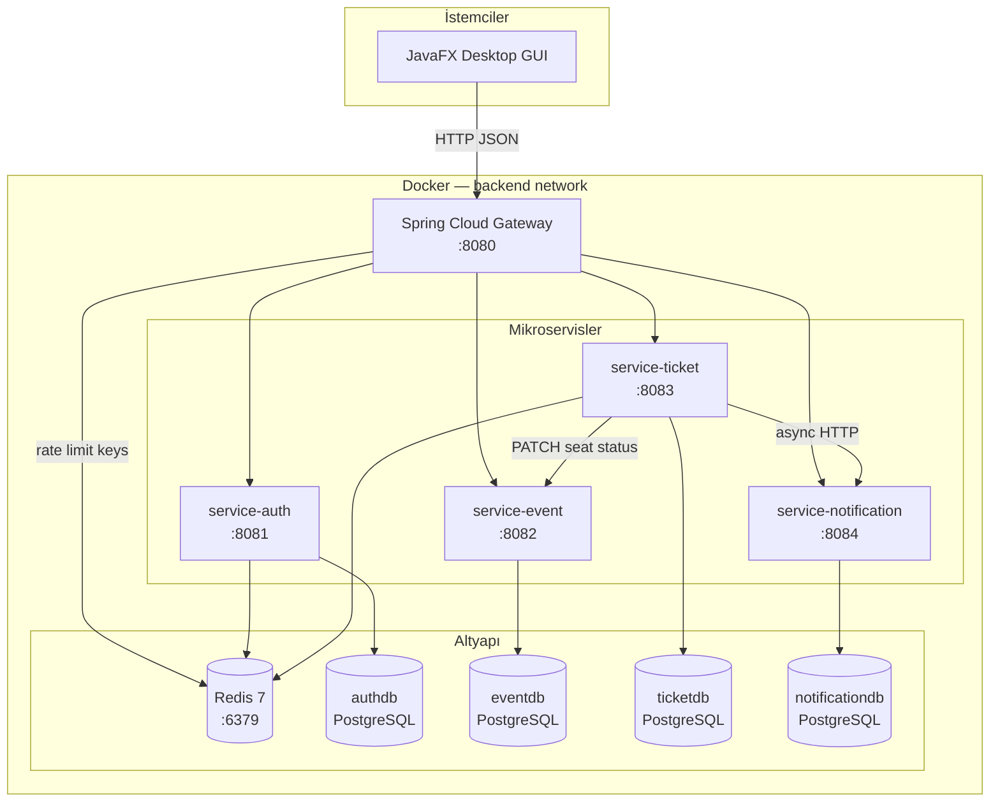
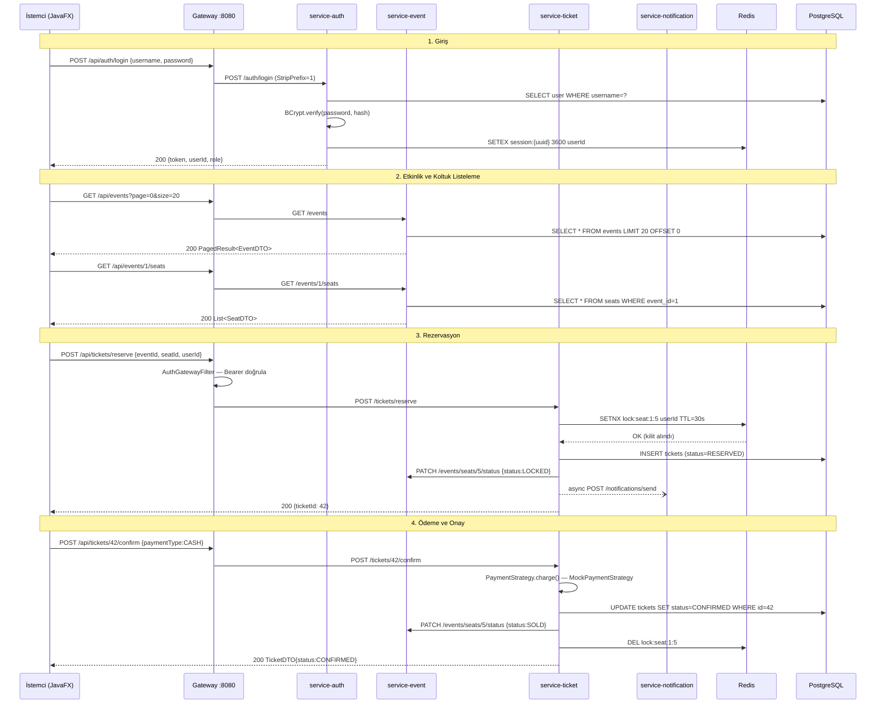
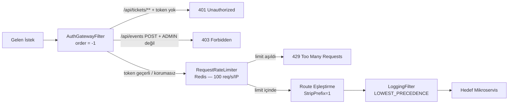

# TBL324 İleri Java Uygulamaları — Final Projesi
# Etkinlik Bilet & Salon Yönetim Sistemi

**Kocaeli Üniversitesi, Bişilim Sistemleri Mühendisliği**
**Ders:** TBL324 İleri Java Uygulamaları
**GitHub:** https://github.com/Sayicon/ileri_java_final

| Öğrenci | Numara |
|---|---|
| Mustafa Kerem Çekici | 231307121 |
| Efe Süzel | 231307059 |

---

## İçindekiler

1. [Proje Özeti](#1-proje-özeti)
2. [Sistem Mimarisi](#2-sistem-mimarisi)
3. [Teknoloji Yığını](#3-teknoloji-yığını)
4. [Servisler ve API Tasarımı](#4-servisler-ve-api-tasarımı)
5. [Generic Yapılar](#5-generic-yapılar)
6. [Veri Katmanı — JDBC ve Redis](#6-veri-katmanı--jdbc-ve-redis)
7. [Güvenlik — JWT ve Redis Denylist](#7-güvenlik--jwt-ve-redis-denylist)
8. [API Gateway ve Rate Limiting](#8-api-gateway-ve-rate-limiting)
9. [Custom GUI — JavaFX Salon Haritası](#9-custom-gui--javafx-salon-haritası)
10. [Tasarım Desenleri ve SOLID](#10-tasarım-desenleri-ve-solid)
11. [Hata Yönetimi](#11-hata-yönetimi)
12. [Test Stratejisi ve TDD](#12-test-stratejisi-ve-tdd)
13. [Performans Testleri](#13-performans-testleri)
14. [Docker ve Dağıtım](#14-docker-ve-dağıtım)
15. [Veritabanı Tasarımı](#15-veritabanı-tasarımı)
16. [Kurulum Kılavuzu](#16-kurulum-kılavuzu)
17. [Tasarım Kararları](#17-tasarım-kararları)
18. [Görev Dağılımı](#18-görev-dağılımı)
19. [Bilinen Sınırlılıklar](#19-bilinen-sınırlılıklar)
20. [Kaynakça](#20-kaynakça)

---

## 1. Proje Özeti

Bu proje, Kocaeli Üniversitesi TBL324 İleri Java Uygulamaları dersi kapsamında geliştirilmiştir. Tema olarak **Etkinlik Bilet ve Salon Yönetim Sistemi** seçilmiştir: konser, tiyatro ve benzeri etkinlikler için kullanıcıların koltuk seçip rezervasyon yapabildiği, yöneticilerin etkinlik ve salon yönetimini gerçekleştirebildiği uçtan uca bir sistem.

### Neden Bu Tema?

- **Mikroservis sınırları doğaldır:** Auth (kimlik doğrulama), Event (etkinlik/salon), Ticket (bilet/rezervasyon) ve Notification (bildirim) sorumlulukları birbirinden bağımsız ve net.
- **Custom GUI için ideal:** Salon koltuk haritası, Canvas API üzerinde programatik çizim gerektiren gerçekçi bir kullanım senaryosu sunar.
- **Redis kullanımı organiktir:** Koltuk kilitleme (race condition önleme), oturum yönetimi ve rate limiting için Redis birincil veri deposu olarak organik bir şekilde kullanılmaktadır; zorlamalı bir cache değildir.
- **Kapsamlı rubrik karşılaması:** Tek bir tutarlı domain, dersin tüm kazanımlarını (API, generics, JDBC+NoSQL, GUI, SOLID, TDD, Docker, gateway) doğal şekilde barındırır.

### Teknik Özet

| Özellik | Değer |
|---|---|
| Dil | Java 21 (LTS) |
| Framework | Spring Boot 3.3.5, Spring Cloud 2023.0.3 |
| Mikroservis sayısı | 4 (Auth, Event, Ticket, Notification) |
| GUI | JavaFX 21 (OpenJFX) |
| Veri katmanı | Saf JDBC + PostgreSQL 16 |
| NoSQL | Redis 7 (Jedis) |
| Build | Maven multi-module |
| Container | Docker + Docker Compose |
| Test | JUnit 5, Testcontainers, WireMock, REST-assured |
| Performans | k6 + JMeter |

---

## 2. Sistem Mimarisi

Sistem, tek bir Docker Compose ağında (`backend`) çalışan mikroservislerden oluşur. Tüm dış trafik yalnızca port **8080** üzerinden Spring Cloud Gateway'e gelir; servisler doğrudan dışarıya açık değildir.

### 2.1 Component Diyagramı



### 2.2 Rezervasyon Akışı (Sequence Diyagramı)



### 2.3 Auth Akışı (Sequence Diyagramı)

```mermaid
sequenceDiagram
    participant C as İstemci
    participant G as Gateway
    participant A as service-auth
    participant R as Redis
    participant DB as PostgreSQL

    Note over C,DB: Kayıt
    C->>G: POST /api/auth/register {username, email, password}
    G->>A: POST /auth/register
    A->>DB: SELECT 1 WHERE username=? OR email=?
    DB-->>A: (boş — çakışma yok)
    A->>A: BCrypt.hash(password, salt)
    A->>DB: INSERT INTO users ...
    A->>R: SETEX session:{uuid} 3600 userId
    A-->>C: 201 {token, userId, role:USER}

    Note over C,DB: Logout
    C->>G: POST /api/auth/logout (Bearer token)
    G->>A: POST /auth/logout
    A->>A: JWT.getSessionId(token)
    A->>R: DEL session:{sessionId}
    A->>R: SETEX revoked:{sessionId} 3600
    A-->>C: 200
```



### 2.4 Gateway Filter Zinciri



---

## 3. Teknoloji Yığını

| Katman | Teknoloji | Sürüm | Gerekçe |
|---|---|---|---|
| Dil | Java | 21 LTS | Records, pattern matching, virtual threads |
| Framework | Spring Boot | 3.3.5 | Industry standard; JDBC/Redis/Web entegrasyonu hazır |
| Gateway | Spring Cloud Gateway | 2023.0.3 | Java native; Kong Lua/Go Java zorunluluğunu zayıflatır |
| Veri (RDBMS) | PostgreSQL | 16.3-alpine | Tam JDBC desteği; Docker'da hafif |
| Veri erişimi | Saf JDBC | Java 21 | Dersin gereksinimi; JPA ORM soyutlaması JDBC katmanını gizler |
| NoSQL | Redis | 7.2-alpine | Session, koltuk lock, rate limit — birincil depo |
| Redis client | Jedis | 5.1.x | Spring Boot 3 uyumlu; JedisPool thread-safe |
| Auth | JJWT | 0.12.6 | JWT HS256, session ID claim, expiry |
| Şifreleme | BCrypt | Spring Security | Adaptive hash; salt otomatik |
| DB migration | Flyway | Spring Boot uyumlu | Sürüm kontrollü şema; V1-V3 her servis |
| Connection pool | HikariCP | Spring Boot uyumlu | Yüksek performanslı JDBC pool |
| API dok. | Springdoc OpenAPI 3 | 2.x | Her servis: `/swagger-ui.html` |
| GUI | JavaFX / OpenJFX | 21 | Canvas custom graphics; CSS theming |
| HTTP client | Java HttpClient | Java 21 | Harici bağımlılık yok; service-to-service |
| Test | JUnit 5 + Mockito + AssertJ | Latest | Modern Java test standardı |
| Entegrasyon testi | Testcontainers | 1.19.x | Gerçek PostgreSQL + Redis |
| API testi | REST-assured | 5.x | Endpoint akışları için DSL |
| Mock HTTP | WireMock | 3.x | Desktop GUI HTTP testleri |
| Performans | k6 | v0.55 | Script-bazlı; Docker image |
| Performans | JMeter | 5.6 | GUI demo için |
| Container | Docker + Compose | Latest | Tek komutla tam stack |
| Build | Maven multi-module | 3.9.9 | Parent POM + 5 child modül |

---

## 4. Servisler ve API Tasarımı

Sistem dört bağımsız mikroservisten oluşmaktadır. Her servis kendi PostgreSQL veritabanına, kendi Flyway migration'larına ve kendi `@ControllerAdvice` hata işleyicisine sahiptir.

### 4.1 service-auth (Port 8081)

Kullanıcı kimlik doğrulama ve oturum yönetiminden sorumludur.

| Metot | Endpoint | Açıklama | Auth |
|---|---|---|---|
| POST | `/auth/register` | Yeni kullanıcı kaydı → 201 + JWT | Yok |
| POST | `/auth/login` | Giriş → 200 + JWT | Yok |
| POST | `/auth/logout` | Token iptal + Redis denylist | Bearer |

**Temel sınıflar:**
- `TokenService` — JJWT 0.12.6 ile JWT üretimi/doğrulaması, session ID claim
- `PasswordHasher` — BCryptPasswordEncoder wrapper
- `SessionRedisRepository` — `session:{uuid}` → userId, `revoked:{uuid}` denylist
- `JwtAuthFilter` — `OncePerRequestFilter`; `/auth/login` ve `/register` hariç tüm yolları korur
- `UserJdbcRepository` — saf JDBC; `findByUsername`, `existsByUsername`, `existsByEmail`

### 4.2 service-event (Port 8082)

Etkinlik, salon ve koltuk yönetiminden sorumludur.

| Metot | Endpoint | Açıklama | Auth |
|---|---|---|---|
| GET | `/events` | Sayfalı etkinlik listesi (`?page=0&size=20`) | Yok |
| GET | `/events/{id}` | Etkinlik detayı | Yok |
| POST | `/events` | Yeni etkinlik oluştur | ADMIN |
| PUT | `/events/{id}` | Etkinlik güncelle | ADMIN |
| DELETE | `/events/{id}` | Etkinlik sil | ADMIN |
| GET | `/events/{id}/seats` | Etkinlik koltukları | Yok |
| PATCH | `/events/seats/{seatId}/status` | Koltuk durumu güncelle | İç servis |
| GET | `/events/ended-ids` | Süresi geçmiş etkinlik ID'leri | İç servis |
| GET | `/venues` | Salon listesi | Yok |

**Temel sınıflar:**
- `EventJdbcRepository`, `SeatJdbcRepository`, `VenueJdbcRepository` — `BaseJdbcRepository<T,ID>` genişletir
- `EventService` — iş mantığı; `findEndedEventIds()` scheduled expiry için
- `EventMapper` — static utility; `toDTO(Event)`, `toEntity(CreateEventRequest)`

### 4.3 service-ticket (Port 8083)

Bilet rezervasyonu, ödeme onayı ve süresi dolma yönetiminden sorumludur.

| Metot | Endpoint | Açıklama | Auth |
|---|---|---|---|
| POST | `/tickets/reserve` | Koltuk rezerve et (Redis lock) | Bearer |
| POST | `/tickets/{id}/confirm` | Ödeme onayla (`paymentType`) | Bearer |
| POST | `/tickets/{id}/cancel` | Rezervasyon iptal | Bearer |
| GET | `/tickets/my?userId={id}` | Kullanıcının biletleri | Bearer |
| GET | `/tickets` | Tüm biletler (admin) | ADMIN |

**Temel sınıflar:**
- `SeatLockService` — `SETNX lock:seat:{eventId}:{seatId}` + 30s TTL; ownership check
- `PaymentStrategy` — `@FunctionalInterface`; `MockPaymentStrategy`, `WalletPaymentStrategy`
- `EventServiceClient` — `Java HttpClient`; `updateSeatStatus()`, `getEndedEventIds()`
- `NotificationServiceClient` — `CompletableFuture` ile async bildirim gönderimi
- `TicketService` — `@Scheduled(fixedRate=60_000)` ile bilet süresi dolma işlemi

### 4.4 service-notification (Port 8084)

Bildirim gönderimi ve kayıt tutmaktan sorumludur.

| Metot | Endpoint | Açıklama |
|---|---|---|
| POST | `/notifications/send` | Bildirim gönder (async) |
| GET | `/notifications/history/{userId}` | Kullanıcı bildirim geçmişi |

**Temel sınıflar:**
- `NotificationFactory` — Factory pattern; `EMAIL/SMS/PUSH` → ilgili `Notifier` implementasyonu
- `EmailNotifier`, `SmsNotifier`, `PushNotifier` — `Notifier` interface'i implement eder; demo için log çıktısı

### 4.5 API Yanıt Formatları

Tüm başarılı yanıtlar `ApiResponse<T>` wrapper ile sarmalanır:

```json
{
  "success": true,
  "data": { ... },
  "message": null,
  "timestamp": "2026-05-15T10:30:00Z"
}
```

Hata yanıtları RFC 7807 ProblemDetail formatındadır:

```json
{
  "type": "about:blank",
  "title": "Not Found",
  "status": 404,
  "detail": "Event with id 99 not found",
  "instance": "/events/99"
}
```

---

## 5. Generic Yapılar

Bu bölüm rubriğin **Generic Yapılar (10 puan)** kriterini karşılar. Tüm generic sınıflar `shared/` modülündedir ve işlevsel — dekoratif değil.

### 5.1 ApiResponse\<T\>

```java
@Jacksonized @Builder
public record ApiResponse<T>(
    boolean success,
    T data,
    String message,
    Instant timestamp
) {
    public static <T> ApiResponse<T> ok(T data) { ... }
    public static <T> ApiResponse<T> error(String message) { ... }
}
```

Tüm REST endpoint'lerin standart dönüş tipidir. `T` parametresi `EventDTO`, `TicketDTO`, `List<SeatDTO>` vb. olabilir.

### 5.2 PagedResult\<T\>

```java
public record PagedResult<T>(
    List<T> content,
    int page,
    int size,
    long totalElements
) {
    public static <T> PagedResult<T> of(List<T> all, int page, int size) { ... }
    public boolean hasNext() { return (long)(page + 1) * size < totalElements; }
    public int totalPages() { return (int) Math.ceil((double) totalElements / size); }
}
```

Sayfalama işlemlerinde `GET /events?page=0&size=20` gibi isteklerde kullanılır.

### 5.3 Repository\<T, ID\>

```java
public interface Repository<T, ID> {
    Optional<T> findById(ID id);
    List<T> findAll();
    T save(T entity);
    void delete(ID id);
}
```

`BaseJdbcRepository<T, ID>` abstract sınıfı bu interface'i implement ederek Template Method Pattern ile JDBC kaynak yönetimini merkezi hâle getirir. Her servisin özel repository'si (`EventJdbcRepository`, `UserJdbcRepository`, vb.) bu sınıfı genişletir.

### 5.4 Validator\<T\>

```java
@FunctionalInterface
public interface Validator<T> {
    ValidationResult validate(T value);
}
```

`ValidationResult` record, `isValid()` ve `errors: Map<String, String>` taşır. DTO doğrulamasında kullanılır.

### 5.5 CollectionOps — Wildcard Kullanımı

```java
public class CollectionOps {

    // ? super T — hedef listeye ekleme (producer extends, consumer super)
    public static <T> void copyAll(List<? super T> dest, List<? extends T> src) {
        dest.addAll(src);
    }

    // ? extends T & Comparable — alt tip güvenli maksimum bulma
    public static <T extends Comparable<? super T>> Optional<T>
            findMax(List<? extends T> list) {
        return list.stream().max(Comparator.naturalOrder());
    }
}
```

PECS (Producer Extends Consumer Super) ilkesini somutlaştıran bu yardımcı sınıf, wildcard türlerinin doğru kullanımını gösterir.

---

## 6. Veri Katmanı — JDBC ve Redis

Bu bölüm rubriğin **JDBC & NoSQL (10 puan)** kriterini karşılar.

### 6.1 Saf JDBC Yaklaşımı

Projede JPA/Hibernate kullanılmamıştır. Tüm veritabanı işlemleri `java.sql.Connection`, `PreparedStatement` ve `ResultSet` API'leri üzerinden yapılmaktadır.

#### BaseJdbcRepository\<T, ID\> — Template Method

```java
public abstract class BaseJdbcRepository<T, ID> implements Repository<T, ID> {

    private final DataSource dataSource;

    // Template Method — alt sınıflar map() metodunu implemente eder
    protected abstract T mapRow(ResultSet rs) throws SQLException;
    protected abstract String getTableName();

    protected Connection getConnection() throws SQLException {
        return dataSource.getConnection(); // HikariCP pool
    }
}
```

Bu yapı:
- Bağlantı alma/kapatma sorumluluğunu üst sınıfta merkezileştirir.
- Her repository yalnızca `mapRow()` ve özel sorgularını implement eder.
- HikariCP ile yönetilen bağlantı havuzu yüksek eş zamanlı isteklerde performanslı çalışır.

#### EventJdbcRepository Örneği

```java
@Repository
public class EventJdbcRepository extends BaseJdbcRepository<Event, Long> {

    @Override
    protected Event mapRow(ResultSet rs) throws SQLException {
        return Event.builder()
            .id(rs.getLong("id"))
            .name(rs.getString("name"))
            .startTime(rs.getTimestamp("start_time").toLocalDateTime())
            .status(EventStatus.valueOf(rs.getString("status")))
            .build();
    }

    public List<Long> findEndedIds() {
        try (Connection c = getConnection();
             PreparedStatement ps = c.prepareStatement(
                 "SELECT id FROM events WHERE end_time < NOW()")) {
            ResultSet rs = ps.executeQuery();
            List<Long> ids = new ArrayList<>();
            while (rs.next()) ids.add(rs.getLong("id"));
            return ids;
        } catch (SQLException e) { throw new RuntimeException(e); }
    }
}
```

### 6.2 Flyway Database Migration

Her servis `src/main/resources/db/migration/` klasöründe versiyon numaralı SQL dosyaları tutar:

| Servis | V1 | V2 | V3 |
|---|---|---|---|
| service-auth | `roles`, `users` tabloları | Rol seed (USER, ADMIN) | Admin kullanıcı seed |
| service-event | `venues`, `events`, `seats` | Salon + etkinlik seed | Ek salon ve 1000 koltuk |
| service-ticket | `tickets` tablosu | — | — |
| service-notification | `notification_logs` tablosu | — | — |

### 6.3 Redis Kullanımı

Redis yalnızca cache olarak değil, **birincil veri deposu** olarak üç kritik alanda kullanılmaktadır:

#### Oturum Yönetimi (service-auth)

```
SETEX session:{uuid}    3600  {userId}    # Giriş
DEL   session:{uuid}                      # Çıkış
SETEX revoked:{uuid}    3600  1           # Token denylist
```

JWT token'ı `sessionId` claim'i taşır. Gateway bu claim'i kontrol ederek iptal edilmiş token'ları reddeder.

#### Koltuk Kilitleme (service-ticket)

```
SETNX lock:seat:{eventId}:{seatId}  {userId}  # Atomik kilit (race condition önler)
EXPIRE lock:seat:{eventId}:{seatId}  30       # 30 saniye TTL — sonra otomatik serbest
DEL   lock:seat:{eventId}:{seatId}            # Onay/iptal sonrası serbest bırak
```

`SETNX` (Set if Not eXists) komutu atomik olduğundan, iki kullanıcının aynı koltuğu aynı anda reserve etmesi mümkün değildir.

#### Rate Limiting (gateway)

Spring Cloud Gateway'in `RequestRateLimiter` filtresi Redis üzerinde sliding window sayacı tutar:

```
GET/INCR ratelimit:{ip}:{endpoint}  # Her istek için artır
EXPIRE   ratelimit:{ip}:{endpoint}  1    # 1 saniye pencere
```

Limit: 100 istek/saniye/IP. Aşıldığında `429 Too Many Requests` döner.

---

## 7. Güvenlik — JWT ve Redis Denylist

### 7.1 JWT Yapısı

JJWT 0.12.6 ile HS256 algoritması kullanılmaktadır. Token payload'ı:

```json
{
  "sub": "kerem",
  "userId": 1,
  "role": "ADMIN",
  "sessionId": "550e8400-e29b-41d4-a716-446655440000",
  "iat": 1715760000,
  "exp": 1715763600
}
```

`sessionId` claim'i Redis denylist ile logout/revoke desteği sağlar.

### 7.2 Gateway'de Token Doğrulama

`AuthGatewayFilter` (order=-1, en önce çalışır):

1. Authorization header kontrolü (`Bearer` prefix)
2. Token imza ve expiry doğrulaması
3. `role` claim'i okuma → admin endpoint'leri için 403 kontrolü
4. `revoked:{sessionId}` Redis key varlık kontrolü → çıkış yapılmış token için 401

### 7.3 Service-Auth'ta Yerel Filter

Her servis kendi `JwtAuthFilter` (`OncePerRequestFilter`) ile de korunmaktadır; gateway'in bypass edilmesine karşı ikinci savunma katmanı.

---

## 8. API Gateway ve Rate Limiting

Bu bölüm rubriğin **Gateway (+5 puan)** ek kriterini karşılar.

Spring Cloud Gateway seçilmiştir — Kong gibi araçlar Go/Lua ile çalıştığından "tüm bileşenler Java" şartını zayıflatacaktı.

### 8.1 Route Yapılandırması

```yaml
spring:
  cloud:
    gateway:
      routes:
        - id: auth-service
          uri: http://service-auth:8081
          predicates: [Path=/api/auth/**]
          filters: [StripPrefix=1]
        - id: event-service
          uri: http://service-event:8082
          predicates: [Path=/api/events/**, /api/venues/**]
          filters: [StripPrefix=1, name: RequestRateLimiter, ...]
        - id: ticket-service
          uri: http://service-ticket:8083
          predicates: [Path=/api/tickets/**]
          filters: [StripPrefix=1, name: RequestRateLimiter, ...]
        - id: notification-service
          uri: http://service-notification:8084
          predicates: [Path=/api/notifications/**]
          filters: [StripPrefix=1]
```

`StripPrefix=1` sayesinde `/api/events/1` → `/events/1` olarak iletilir.

### 8.2 Filter Katmanları

| Filter | Order | Görev |
|---|---|---|
| `AuthGatewayFilter` | -1 (ilk) | JWT doğrulama, rol kontrolü, denylist |
| `RequestRateLimiter` | Varsayılan | Redis tabanlı; 100 req/s/IP |
| `LoggingFilter` | `LOWEST_PRECEDENCE` (son) | method + path loglama |

---

## 9. Custom GUI — JavaFX Salon Haritası

Bu bölüm rubriğin **Custom GUI (10 puan)** kriterini karşılar.

### 9.1 Mimari

Desktop uygulaması `JavaFX 21` ile geliştirilmiştir. Ekranlar arası geçiş `DesktopApp.java` üzerinde merkezi `makeScene()` helper ile yönetilir; her ekran CSS otomatik olarak yüklenir.

```
DesktopApp
├── LoginView          — kullanıcı/şifre girişi, role-based yönlendirme
├── EventListView      — etkinlik listesi (ListView + özel ListCell)
├── SeatMapView ⭐     — Canvas koltuk haritası (custom graphics)
├── MyTicketsView      — kullanıcının biletleri (TableView + badge)
└── AdminDashboardView — admin panel (TabPane: etkinlikler + rezervasyonlar)
```

### 9.2 SeatMapView — Canvas Grafikleri

Koltuk haritası `javafx.scene.canvas.Canvas` üzerine `GraphicsContext` ile çizilmektedir. Bu, herhangi bir hazır bileşen değil tamamen programatik bir çizimdir.

```java
private void drawSeatMap(GraphicsContext gc, List<SeatDTO> seats,
                          int cols, double cellSize) {
    for (int i = 0; i < seats.size(); i++) {
        SeatDTO seat = seats.get(i);
        int row = i / cols;
        int col = i % cols;
        double x = col * cellSize + MARGIN;
        double y = row * cellSize + MARGIN;

        // Durum rengini SeatColorMapper'dan al
        Color color = SeatColorMapper.fxColorFor(seat.status());

        gc.setFill(color);
        gc.fillRoundRect(x, y, cellSize - GAP, cellSize - GAP, 4, 4);

        // Seçili koltuğa kenarlık
        if (selectedSeatIds.contains(seat.id())) {
            gc.setStroke(Color.DARKBLUE);
            gc.setLineWidth(2.0);
            gc.strokeRoundRect(x, y, cellSize - GAP, cellSize - GAP, 4, 4);
        }
    }
}
```

**Koltuk Renk Paleti:**

| Durum | Renk | Açıklama |
|---|---|---|
| `AVAILABLE` | Yeşil (#4CAF50) | Seçilebilir koltuk |
| `SELECTED` | Turuncu (#FF9800) | Kullanıcının seçtiği (yerel) |
| `LOCKED` | Sarı (#FFC107) | Başka biri ödüyor |
| `SOLD` | Kırmızı (#F44336) | Satıldı |

**Tıklama → Koordinat Hesaplama:**

```java
canvas.setOnMouseClicked(e -> {
    // Piksel koordinatından ızgara pozisyonuna
    int col = (int)((e.getX() - MARGIN) / cellSize);
    int row = (int)((e.getY() - MARGIN) / cellSize);
    int index = row * cols + col;
    if (index >= 0 && index < seats.size()) {
        SeatDTO seat = seats.get(index);
        if (seat.status() == SeatStatus.AVAILABLE) {
            toggleSelection(seat.id());
            redrawCanvas();
        }
    }
});
```

### 9.3 Ödeme Diyaloğu

Rezervasyon sonrası `showPaymentDialog()` ile ödeme tipi seçilir:

```
┌──────────────────────────┐
│    Ödeme Yöntemi Seç     │
│  3 koltuk seçildi        │
│                          │
│  [Nakit]  [Kredi Kartı]  │
│         [İptal]          │
└──────────────────────────┘
```

### 9.4 Admin Dashboard

Admin girişinde `AdminDashboardView` açılır:
- **Etkinlikler sekmesi:** TableView + DatePicker/Spinner ile etkinlik oluşturma
- **Tüm Rezervasyonlar sekmesi:** Renkli badge'li bilet durumu, "Onayla" butonu
- **Koltuk haritası diyaloğu:** Etkinliğe tıklayınca Canvas ile koltuk durumu görselleştirme

### 9.5 CSS Tema

`style.css` dosyasıyla tüm ekranlarda tutarlı Material Design benzeri tema uygulanır:
- Primary: `#1565C0` (koyu mavi)
- Surface: `#FFFFFF`
- Background: `#F5F5F5`
- Badge'ler: CONFIRMED yeşil, PENDING sarı, CANCELLED kırmızı, EXPIRED gri

### 9.6 Virtual Threads

JavaFX'in UI thread'ini bloklamadan ağ istekleri `Thread.ofVirtual().start(...)` ile arka planda yürütülür:

```java
Thread.ofVirtual().start(() -> {
    List<SeatDTO> seats = apiClient.getSeats(eventId);
    Platform.runLater(() -> {
        this.seats = seats;
        drawSeatMap(...);
    });
});
```

---

## 10. Tasarım Desenleri ve SOLID

Bu bölüm rubriğin **SOLID & OOP (10 puan)** kriterini karşılar.

### 10.1 Strategy Pattern — Ödeme

```java
@FunctionalInterface
public interface PaymentStrategy {
    boolean charge(Long ticketId, double amount);
}

// Somut implementasyonlar
public class MockPaymentStrategy  implements PaymentStrategy { ... } // Her zaman true
public class WalletPaymentStrategy implements PaymentStrategy { ... } // Bakiye kontrolü
public class FailingPaymentStrategy implements PaymentStrategy { ... } // Test için
```

`TicketService.confirm()` metodu `PaymentStrategy` alır; ödeme tipini değiştirmek için `TicketService`'i değiştirmek gerekmez (OCP).

### 10.2 Factory Pattern — Bildirim

```java
public class NotificationFactory {
    public static Notifier create(NotificationType type) {
        return switch (type) {
            case EMAIL -> new EmailNotifier();
            case SMS   -> new SmsNotifier();
            case PUSH  -> new PushNotifier();
        };
    }
}
```

`NotificationService`, `NotificationFactory.create()` ile uygun notifier'ı alır; somut implementasyona doğrudan bağımlı değildir (DIP).

### 10.3 Template Method Pattern — BaseJdbcRepository

```java
public abstract class BaseJdbcRepository<T, ID> {
    // Sabit iskelet: bağlantı yönetimi, kaynak kapatma
    public Optional<T> findById(ID id) {
        try (Connection c = getConnection(); ...) {
            return Optional.ofNullable(mapRow(rs));
        }
    }
    // Değişken adım: alt sınıf implement eder
    protected abstract T mapRow(ResultSet rs) throws SQLException;
}
```

### 10.4 Repository Pattern

Her domain entity için ayrı repository arayüzü:

```
Repository<T, ID>         ← shared modül (generic interface)
  └── BaseJdbcRepository  ← abstract JDBC implementasyonu
        ├── EventJdbcRepository
        ├── SeatJdbcRepository
        ├── UserJdbcRepository
        └── TicketJdbcRepository
```

### 10.5 Builder Pattern

Domain nesneleri immutable + explicit Builder ile oluşturulur (Lombok `@Builder` annotation processor ortam sorunları nedeniyle elle yazılmıştır):

```java
public class Event {
    private final Long id;
    private final String name;
    // ...
    private Event(Builder b) { this.id = b.id; ... }

    public static Builder builder() { return new Builder(); }
    public static class Builder {
        public Builder id(Long id) { this.id = id; return this; }
        public Event build() { return new Event(this); }
    }
}
```

### 10.6 SOLID İlkeleri

| İlke | Somut Uygulama |
|---|---|
| **S**RP | Her servisin tek sorumluluğu; `EventService` sadece iş mantığı, `EventJdbcRepository` sadece veri erişimi |
| **O**CP | `PaymentStrategy` interface'i; yeni ödeme tipi eklemek mevcut kodu değiştirmez |
| **L**SP | `BaseJdbcRepository` alt sınıfları üst sınıf yerine her yerde kullanılabilir |
| **I**SP | `Repository<T,ID>` küçük ve odaklı; `Validator<T>` tek metotlu functional interface |
| **D**IP | `NotificationService` somut `EmailNotifier`'a değil `Notifier` arayüzüne bağlıdır |

---

## 11. Hata Yönetimi

Bu bölüm rubriğin **Hata Yönetimi (5 puan)** kriterini karşılar.

### 11.1 RFC 7807 Problem Details

Her servis `@RestControllerAdvice` + Spring 6 `ProblemDetail` ile standart hata yanıtları üretir:

```java
@RestControllerAdvice
public class GlobalExceptionHandler {

    @ExceptionHandler(NotFoundException.class)
    public ResponseEntity<ProblemDetail> handleNotFound(NotFoundException ex) {
        ProblemDetail pd = ProblemDetail.forStatusAndDetail(HttpStatus.NOT_FOUND, ex.getMessage());
        return ResponseEntity.status(404).body(pd);
    }

    @ExceptionHandler(HttpMessageNotReadableException.class)
    public ResponseEntity<ProblemDetail> handleBadRequest(HttpMessageNotReadableException ex) {
        ProblemDetail pd = ProblemDetail.forStatusAndDetail(HttpStatus.BAD_REQUEST,
            "Geçersiz istek gövdesi: " + ex.getMessage());
        return ResponseEntity.status(400).body(pd);
    }
}
```

### 11.2 HTTP Durum Kodu Haritası

| Kod | Durum | Tetikleyen Durum |
|---|---|---|
| 400 | Bad Request | Geçersiz JSON, validation hatası |
| 401 | Unauthorized | Token yok veya geçersiz |
| 403 | Forbidden | Yetkisiz rol (USER admin endpoint'e erişiyor) |
| 404 | Not Found | Kayıt bulunamadı |
| 409 | Conflict | Kullanıcı adı çakışması, koltuk zaten alındı |
| 429 | Too Many Requests | Rate limit aşıldı |
| 500 | Internal Server Error | Beklenmeyen hata (log'a yazılır) |
| 503 | Service Unavailable | Bağımlı servis erişilemiyor |

### 11.3 İstemci Tarafı Hata Gösterimi

Desktop GUI'de `ApiException.extractDetail()` metodu RFC 7807 yanıtındaki `detail` alanını parse ederek kullanıcıya anlamlı mesaj gösterir (ham HTTP status kodu yerine).

---

## 12. Test Stratejisi ve TDD

Bu bölüm rubriğin hem **TDD (+10 puan)** ek kriterini hem de temel test gereksinimlerini karşılar.

### 12.1 TDD Metodolojisi

Her geliştirme biriminde testler uygulamadan önce yazılıp commit edilir (kırmızı durum), ardından bu testleri geçirecek minimum kod yazılır (yeşil durum). `test-logs/` klasöründe her modül için `*-red.txt` ve `*-green.txt` Maven çıktıları saklanmaktadır. Git commit timestamp farkı, testin önce yazıldığının kanıtıdır.

### 12.2 Test Seviyeleri

| Seviye | Araç | Kullanım |
|---|---|---|
| Unit | JUnit 5 + Mockito | `TokenService`, `PaymentStrategy`, domain mantığı |
| Integration | Testcontainers (PostgreSQL, Redis) | Repository CRUD, servis-DB bütünleşmesi |
| API / REST | REST-assured + `@SpringBootTest` | Endpoint'ler arası tam akış |
| HTTP Mock | WireMock | Desktop GUI → backend API çağrıları |
| Gateway | `WebTestClient` + `StepVerifier` | Reactive filter zinciri |

### 12.3 Modül Bazlı Test Özeti

| Modül | Test Sayısı | Kapsam |
|---|---|---|
| Uygulama bağlamı | 2 | ApplicationContext yükü |
| shared — generic yapılar | 30 | ApiResponse, PagedResult, Validator, CollectionOps |
| service-event | 19 | EventController (WebMvcTest), Repository (Testcontainers PG) |
| service-auth | 10 | PasswordHasher, TokenService, SessionRedis, AuthController |
| service-ticket + notification | 22 + 10 | TicketService (SeatLock, PaymentStrategy), NotificationFactory |
| desktop-gui | 15 | ApiClient (WireMock), SeatGrid, SeatColorMapper |
| gateway | 5 + 4 | AuthGatewayFilter (unit), Gateway integration (WebTestClient) |
| Biletlerim özelliği | 8 | MyTickets endpoint ve filtreleme |
| Ödeme akışı | 9 | confirm/cancel, PaymentStrategy entegrasyonu |
| Admin paneli | 7 | Admin endpoints, getAllTickets |

**Toplam: ~141 test**

### 12.4 Testcontainers Yapılandırması

Docker API uyumluluğu için `docker-java.properties` classpath konfigürasyonu:

```properties
# src/test/resources/docker-java.properties
dockerClientStrategyClassName=com.github.dockerjava.core.DockerClientConfig
```

Docker olmayan ortamlarda (`@DisabledWithoutDocker`) testler atlanır; CI pipeline'da tüm testler çalışır.

---

## 13. Performans Testleri

Bu bölüm rubriğin **Performans Testleri (5 puan)** kriterini karşılar.

### 13.1 Test Ortamı

| Bileşen | Detay |
|---|---|
| Platform | Windows 11 Pro, Docker Desktop |
| Test aracı | k6 v0.55 (grafana/k6 Docker image) |
| Stack | Docker Compose — 5 servis + 4 PostgreSQL + Redis |
| Gateway | localhost:8080 |

### 13.2 Senaryo Sonuçları

#### Load Test — Normal Yük (50 VU, 5 dk)

| Metrik | Değer | Eşik | Sonuç |
|---|---|---|---|
| p(95) latency | **4.05 ms** | < 500 ms | ✓ |
| Toplam istek | 62,965 | — | — |
| RPS | 198.15 req/s | — | — |

#### Stress Test — Kırılma Noktası (10→500 VU, 16 dk)

| Metrik | Değer | Eşik | Sonuç |
|---|---|---|---|
| p(99) latency | **8.75 ms** | < 2000 ms | ✓ |
| Peak RPS | 2,024.60 req/s | — | — |
| Toplam istek | 1,943,734 | — | — |

500 VU'da sistem kararlı kaldı; kırılma noktasına ulaşılmadı.

#### Spike Test — Ani Yük (10→200→10 VU, ~7 dk)

| Metrik | Değer | Eşik | Sonuç |
|---|---|---|---|
| p(95) latency | **6.01 ms** | < 1000 ms | ✓ |
| Recovery | Sorunsuz | — | ✓ |

#### Soak Test — Uzun Süreli Kararlılık (30 VU, 30 dk)

Script hazır (`perf-tests/k6/soak-test.js`); uzun süreli memory leak ve connection pool tükenmesi testi için CI pipeline'a entegre edilmek üzere tasarlanmıştır.

### 13.3 Darboğaz Analizi

| Darboğaz | Sebep | Not |
|---|---|---|
| Yüksek error rate | Redis rate limiting `/api/auth/login` | Güvenlik özelliği, servis hatası değil |
| Reserve endpoint 0 başarı | Test sırasında koltuklar doldu | Test veri izolasyonu öneriyle belirtildi |
| 401 error rate | Stress/spike testlerde token yok | Beklenen; auth token gerektiren endpoint |

### 13.4 JMeter Test Planı

`perf-tests/event-ticketing.jmx` — 50 thread, 5 dakika:
1. Login (JSONPath token extractor)
2. GET /api/events (JSONPath eventId extractor)
3. GET /api/events/{id}/seats (JSONPath seatId extractor)
4. POST /api/tickets/reserve

---

## 14. Docker ve Dağıtım

Bu bölüm rubriğin **Dockerize Sistem (+5 puan)** ek kriterini karşılar.

### 14.1 Multi-Stage Dockerfile

```dockerfile
# Stage 1: Build
FROM maven:3.9-eclipse-temurin-21-alpine AS builder
WORKDIR /workspace
COPY pom.xml .
COPY shared/ shared/
COPY service-event/ service-event/
RUN mvn -pl shared,service-event -am package -DskipTests

# Stage 2: Runtime
FROM eclipse-temurin:21-jre-alpine
WORKDIR /app
COPY --from=builder /workspace/service-event/target/*.jar app.jar
EXPOSE 8082
ENTRYPOINT ["java", "-jar", "app.jar"]
```

### 14.2 Docker Compose Yapısı

```yaml
services:
  service-auth:
    build: ./service-auth
    environment:
      - SPRING_DATASOURCE_URL=jdbc:postgresql://authdb:5432/authdb
      - JWT_SECRET=${JWT_SECRET}
    depends_on:
      authdb: { condition: service_healthy }
      redis:  { condition: service_healthy }
    networks: [backend]

  gateway:
    build: ./gateway
    ports: ["8080:8080"]   # Tek dış port
    networks: [backend]

  redis:
    image: redis:7.2-alpine
    healthcheck:
      test: ["CMD", "redis-cli", "ping"]
    networks: [backend]

networks:
  backend:
    driver: bridge
```

**Güvenlik notu:** Yalnızca port `8080` (gateway) dışarıya açıktır. Servisler ve veritabanları Docker iç ağında kalır.

### 14.3 Ortam Değişkenleri

```bash
# .env.example (commit edilir)
POSTGRES_USER=tbl324
POSTGRES_PASSWORD=changeme
JWT_SECRET=change-this-in-production-min-32-chars

# .env (gitignore'da — gerçek değerler)
```

### 14.4 Makefile Hedefleri

```bash
make up              # Tüm stack'i başlat
make down            # Durdur
make build           # Image'ları yeniden derle
make rebuild-core    # service-event + service-ticket yeniden derle
make logs-event      # service-event logları
make clean           # Container + volume + image sil
make smoke           # Smoke test koştur
```

---

## 15. Veritabanı Tasarımı

Her mikroservis kendi izole veritabanına sahiptir. Cross-servis ilişkiler foreign key değil, servis çağrıları üzerinden kurulur.

### 15.1 service-auth — authdb

```sql
CREATE TABLE roles (
    id   BIGSERIAL PRIMARY KEY,
    name VARCHAR(50) UNIQUE NOT NULL  -- 'USER', 'ADMIN'
);

CREATE TABLE users (
    id           BIGSERIAL PRIMARY KEY,
    username     VARCHAR(100) UNIQUE NOT NULL,
    email        VARCHAR(255) UNIQUE NOT NULL,
    password_hash VARCHAR(255) NOT NULL,
    role_id      BIGINT REFERENCES roles(id),
    created_at   TIMESTAMP DEFAULT NOW()
);
```

### 15.2 service-event — eventdb

```sql
CREATE TABLE venues (
    id       BIGSERIAL PRIMARY KEY,
    name     VARCHAR(255) NOT NULL,
    capacity INT NOT NULL
);

CREATE TABLE events (
    id         BIGSERIAL PRIMARY KEY,
    name       VARCHAR(255) NOT NULL,
    venue_id   BIGINT REFERENCES venues(id),
    start_time TIMESTAMP NOT NULL,
    end_time   TIMESTAMP NOT NULL,
    status     VARCHAR(20) DEFAULT 'ACTIVE'  -- ACTIVE, CANCELLED, COMPLETED
);

CREATE TABLE seats (
    id       BIGSERIAL PRIMARY KEY,
    event_id BIGINT REFERENCES events(id),
    row_num  INT NOT NULL,
    col_num  INT NOT NULL,
    status   VARCHAR(20) DEFAULT 'AVAILABLE'  -- AVAILABLE, LOCKED, SOLD
);
```

### 15.3 service-ticket — ticketdb

```sql
CREATE TABLE tickets (
    id           BIGSERIAL PRIMARY KEY,
    event_id     BIGINT NOT NULL,
    seat_id      BIGINT NOT NULL,
    user_id      BIGINT NOT NULL,
    status       VARCHAR(20) DEFAULT 'RESERVED',  -- RESERVED, CONFIRMED, CANCELLED, EXPIRED
    payment_type VARCHAR(50),
    created_at   TIMESTAMP DEFAULT NOW(),
    expires_at   TIMESTAMP,
    UNIQUE (event_id, seat_id)
);
```

### 15.4 service-notification — notificationdb

```sql
CREATE TABLE notification_logs (
    id         BIGSERIAL PRIMARY KEY,
    user_id    BIGINT NOT NULL,
    type       VARCHAR(20) NOT NULL,  -- EMAIL, SMS, PUSH
    message    TEXT NOT NULL,
    sent_at    TIMESTAMP DEFAULT NOW()
);
```

### 15.5 Koltuk Durumu Yaşam Döngüsü

```
AVAILABLE
    │
    ▼ reserve() — Redis SETNX + DB update
  LOCKED
    │         │
    ▼         ▼ cancel() / expire (TTL)
SOLD (CONFIRM)   AVAILABLE
    │
    ▼ @Scheduled expiry (etkinlik bitti)
  EXPIRED
```

---

## 16. Kurulum Kılavuzu

### Ön Koşullar

- Docker Desktop (v24+)
- Git

> Java veya Maven kurulu olması gerekmez — Maven Wrapper ve Docker her şeyi sağlar.

### Hızlı Başlangıç

```bash
# 1. Repoyu klonla
git clone https://github.com/Sayicon/ileri_java_final.git
cd ileri_java_final

# 2. Ortam değişkenlerini ayarla
cp .env.example .env
# .env dosyasını düzenle: JWT_SECRET en az 32 karakter olmalı

# 3. Derle ve başlat
make build
make up

# 4. Servislerin hazır olmasını bekle (~30 saniye)
make ps

# 5. Smoke test
make smoke
```

### Erişim Noktaları

| Servis | URL |
|---|---|
| API Gateway | http://localhost:8080 |
| Auth Swagger | http://localhost:8081/swagger-ui.html |
| Event Swagger | http://localhost:8082/swagger-ui.html |
| Ticket Swagger | http://localhost:8083/swagger-ui.html |
| Notification Swagger | http://localhost:8084/swagger-ui.html |

### Desktop GUI Başlatma

```bash
# Desktop modülünü Maven ile çalıştır
cd desktop-gui
../mvnw javafx:run
```

Veya IntelliJ IDEA'dan `DesktopApp.main()` çalıştırılabilir.

### Varsayılan Kullanıcılar (Seed Data)

| Kullanıcı | Şifre | Rol |
|---|---|---|
| admin1 | password123 | ADMIN |
| user1 | password123 | USER |

---

## 17. Tasarım Kararları

| # | Karar | Seçim | Gerekçe |
|---|---|---|---|
| 1 | Tema | Etkinlik bileti & salon | Mikroservis sınırları doğal; Canvas için ideal use case |
| 2 | Veri erişimi | Saf JDBC | Dersin JDBC gereksinimi; JPA ORM katmanı JDBC'yi gizler |
| 3 | NoSQL | Redis | Session/lock/rate-limit için organik; Mongo zorlamalı olurdu |
| 4 | Mobil | Kapsam dışı | +5 puan vazgeçildi; JavaFX desktop yeterli, riski azaltır |
| 5 | Gateway | Spring Cloud Gateway | Java native; Kong (Lua/Go) zorunluluğu zayıflatır |
| 6 | Servis sayısı | 4 | Doğal sınırlar; cross-service çağrı (Ticket→Event, Ticket→Notification) |
| 7 | Custom graphics | Salon haritası (Canvas) | Domain ile entegre; standart bileşen değil |
| 8 | Build | Maven multi-module | Spring ekosistemi; parent POM + 5 child |
| 9 | Auth | JWT + Redis denylist | Stateless + logout/revoke desteği |
| 10 | Test | Unit + Testcontainers + REST-assured | TDD rubriği; H2 mock beklenmedik uyumsuzluklara açık |
| 11 | Ödeme | Mock PaymentStrategy | Kapsam dışı; Strategy pattern için somut örnek |
| 12 | Builder pattern | Manuel (Lombok yok) | Annotation processor ortam sorunu; manuel builder daha şeffaf |

---

## 18. Görev Dağılımı

**Toplam commit:** 54 (Kerem: 31, %57 — Efe: 23, %43)

| Bileşen / Özellik | Sorumluluk | Sorumlu |
|---|---|---|
| Proje iskeleti | Maven multi-module, POM, temel yapı | Kerem + Efe |
| shared — Generic yapılar | ApiResponse, PagedResult, Repository, Validator, CollectionOps | Kerem |
| service-event | Event/Venue/Seat CRUD, Flyway, BaseJdbcRepository, Swagger | Efe |
| service-auth | JWT, BCrypt, Redis session, register/login/logout | Kerem |
| service-ticket + notification | SeatLock, PaymentStrategy, Factory, NotificationService | Kerem + Efe |
| JavaFX Desktop GUI | LoginView, EventListView, SeatMapView (Canvas), ApiClient | Efe |
| API Gateway | AuthGatewayFilter, RateLimiter, LoggingFilter, route config | Kerem |
| Docker & altyapı | Multi-stage Dockerfile, docker-compose.yml, .env, Makefile | Kerem |
| Performans testleri | k6 senaryoları, JMeter planı, performans raporu | Efe |
| Dokümantasyon | README, Mermaid diyagramlar, test logları | Kerem |
| Biletlerim özelliği | GET /tickets/my, MyTicketsView, badge sistem | Efe |
| Ödeme akışı | confirmTicket, showPaymentDialog, TicketDTO dönüşü | Kerem |
| Admin paneli | AdminDashboardView, getAllTickets, admin bilet onaylama | Efe |
| UI revizyon & CSS | style.css, header tasarımı, EventListView kart, badge'ler | Kerem |
| Servis iyileştirmeleri | Seat status güncelleme, gateway role kontrolü, token revoke, seed data | Kerem + Efe |

---

## 19. Bilinen Sınırlılıklar

1. **Ödeme entegrasyonu mock'tur.** `MockPaymentStrategy` ve `WalletPaymentStrategy` gerçek bir ödeme altyapısına bağlı değildir; Strategy pattern'ı somutlaştırmak için bulunmaktadır.

2. **Bildirimler mock'tur.** `EmailNotifier`, `SmsNotifier`, `PushNotifier` gerçek SMTP/SMS servisi kullanmaz; bildirimler log çıktısına yazılır. Factory ve Strategy pattern'ları gösterilmektedir.

3. **Soak test lokal ortamda tam koşturulmamıştır.** 30 dakikalık soak test script hazır (`perf-tests/k6/soak-test.js`) fakat süre kısıtı nedeniyle CI pipeline'a bırakılmıştır.

4. **Service discovery yoktur.** Gateway route'ları statik YAML konfigürasyonuyla tanımlanmıştır; Eureka/Consul gibi dinamik discovery kullanılmamaktadır. 4 servis için bu yaklaşım yeterlidir.

5. **Horizontal scaling test edilmemiştir.** Mevcut yapı `docker compose up --scale service-ticket=3` ile scale-out edilebilir ancak stateful Redis lock mekanizması birden fazla gateway örneği durumunda ek konfigürasyon gerektirebilir.

---

## 20. Kaynakça

1. Spring Boot Reference Documentation — https://docs.spring.io/spring-boot/docs/3.3.5/reference/
2. Spring Cloud Gateway Reference — https://docs.spring.io/spring-cloud-gateway/reference/
3. JJWT (Java JWT) GitHub — https://github.com/jwtk/jjwt
4. Redis Documentation — SETNX, SETEX, TTL — https://redis.io/docs/
5. k6 Load Testing Documentation — https://grafana.com/docs/k6/
6. Testcontainers for Java — https://java.testcontainers.org/
7. JavaFX 21 API Documentation — https://openjfx.io/javadoc/21/
8. RFC 7807 — Problem Details for HTTP APIs — https://www.rfc-editor.org/rfc/rfc7807
9. Martin, R. C. (2008). *Clean Code: A Handbook of Agile Software Craftsmanship.* Prentice Hall.
10. Fowler, M. (2002). *Patterns of Enterprise Application Architecture.* Addison-Wesley.
11. Newman, S. (2019). *Building Microservices* (2nd ed.). O'Reilly Media.
12. HikariCP GitHub — https://github.com/brettwooldridge/HikariCP
13. Flyway Documentation — https://documentation.red-gate.com/flyway/
14. WireMock Documentation — https://wiremock.org/docs/

---

*Kocaeli Üniversitesi, Bilgisayar Mühendisliği*
*TBL324 İleri Java Uygulamaları — 2026 Bahar Dönemi*
