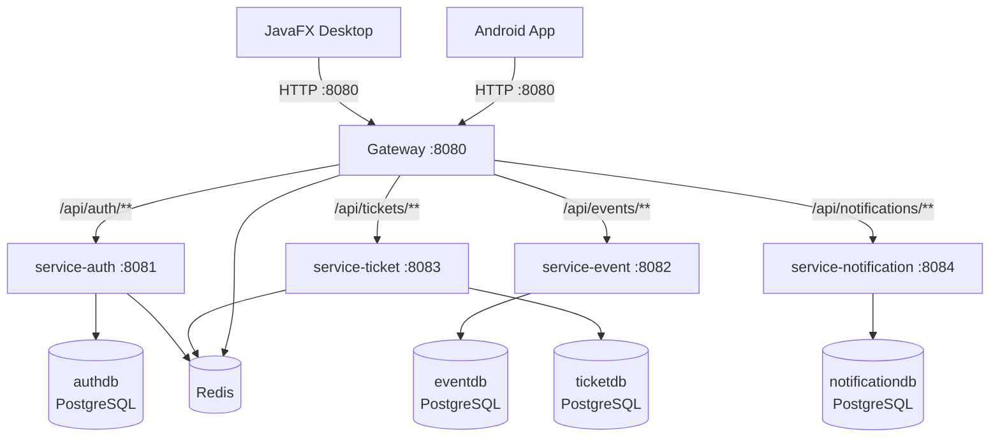
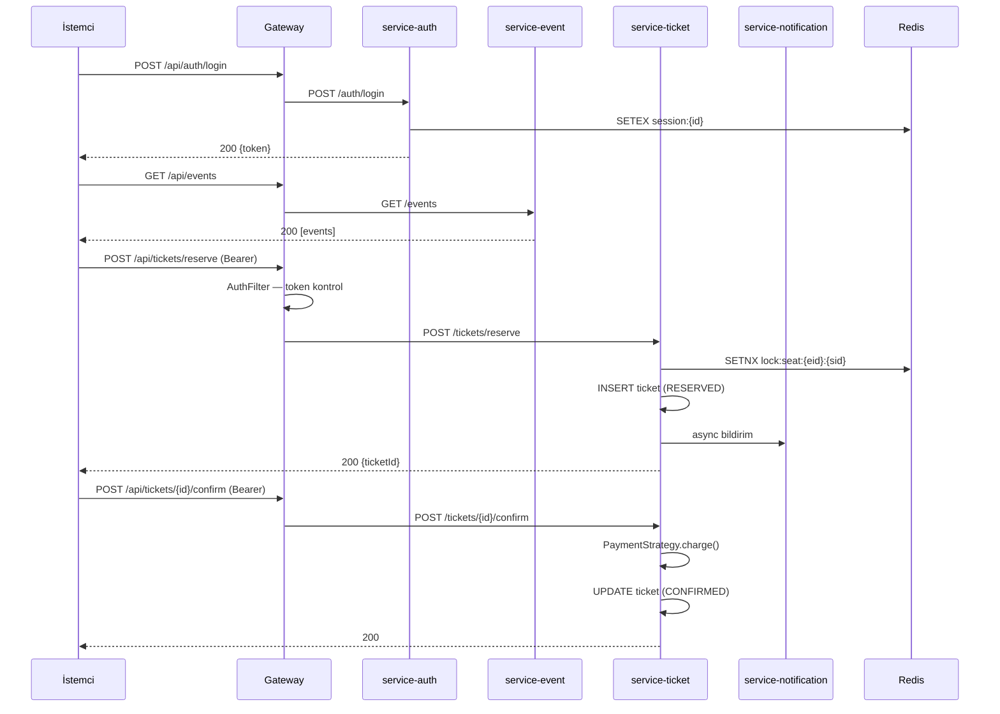
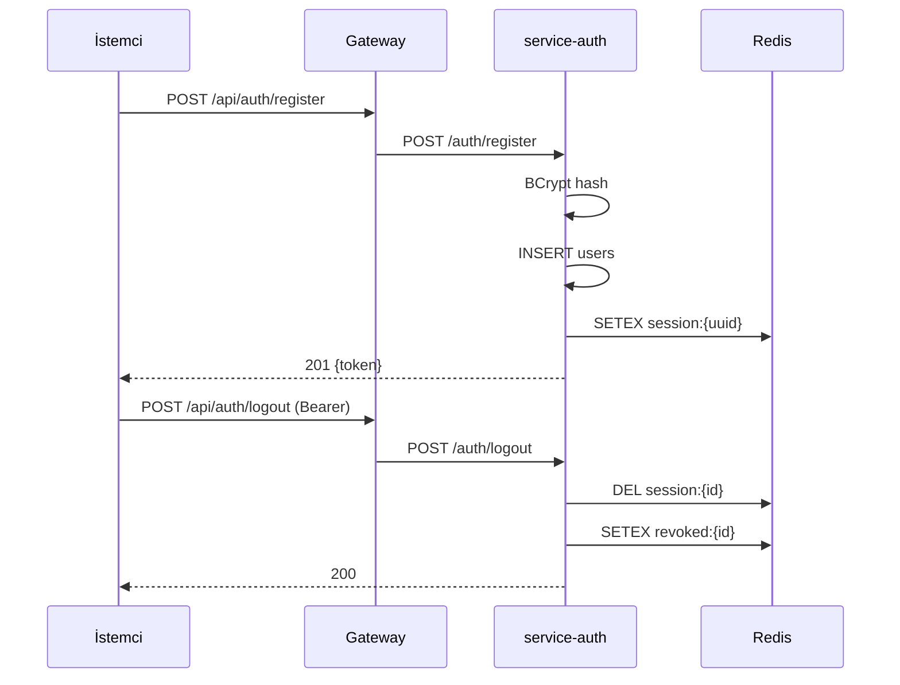

# TBL324 — Event Ticketing & Venue Management System

**Kocaeli Üniversitesi · Teknoloji Fakültesi · Bilişim Sistemleri Mühendisliği**  
TBL324 İleri Java Uygulamaları Dersi — Final Projesi

**Ekip:** Kerem Çekici · Efe Suzel

---

## 1. Proje Özeti

Etkinlik Bileti & Salon Yönetim Sistemi; dört ayrı Spring Boot mikroservisi, bir Spring Cloud Gateway, JavaFX masaüstü istemcisi ve Android mobil istemcisinden oluşan tam yığın bir Java uygulamasıdır. Proje dersin **dağıtık sistem · OOP · veri katmanı · test** kazanımlarını tek bir bütünleşik yapıda ölçmek amacıyla geliştirilmiştir.

Kullanıcılar etkinlikleri listeleyebilir, salon koltuk haritasını görebilir, koltuk rezervasyonu yapabilir ve ödeme akışını tamamlayabilir. Tüm bu işlemler hem masaüstü (JavaFX) hem de mobil (Android) arayüzden gerçekleştirilebilir.

---

## 2. Mimari Genel Bakış



- **Gateway** tek dış giriş noktasıdır (port 8080). Tüm diğer servisler `backend` Docker ağı içinde izoledir.
- **AuthGatewayFilter** — `/api/tickets/**` rotaları için Bearer token zorunludur.
- **RequestRateLimiter** — Redis tabanlı IP başına 100 istek/sn.

---

## 3. Sequence Diagram'lar

### Rezervasyon Akışı



### Login & Logout Akışı



---

## 4. Teknoloji Yığını

| Katman | Teknoloji | Versiyon |
|---|---|---|
| Dil | Java | 21 |
| Backend framework | Spring Boot | 3.3.5 |
| Servis ağı | Spring Cloud Gateway | 2023.0.3 |
| Veri erişimi | Saf JDBC + HikariCP | — |
| Veritabanı | PostgreSQL | 16.3 |
| NoSQL / Cache | Redis (Jedis) | 7.2 / 5.1.0 |
| Migrasyon | Flyway | 10.x |
| Auth | JJWT | 0.12.6 |
| Masaüstü GUI | JavaFX | 21 |
| Mobil GUI | Android native Java | minSdk 24 |
| HTTP istemci (Android) | Retrofit + OkHttp | 2.9 |
| Build (backend) | Maven multi-module | 3.9.9 |
| Build (Android) | Gradle | 8.x |
| Test | JUnit 5 + Testcontainers + REST-assured | — |
| Performans testi | k6 + JMeter | — |
| Konteyner | Docker Compose | v2 |
| API dökümantasyon | Springdoc OpenAPI | 2.6.0 |

---

## 5. Hızlı Başlangıç

**Gereksinimler:** Docker 24+ · Docker Compose v2 · Java 21 (JavaFX için)

```bash
# 1. Klonla
git clone https://github.com/Sayicon/ileri_java_final.git
cd ileri_java_final

# 2. Ortam değişkenlerini ayarla
cp .env.example .env
# .env içindeki POSTGRES_PASSWORD ve JWT_SECRET değerlerini değiştir

# 3. Backend stack'i başlat
docker compose up -d

# 4. Doğrula
curl http://localhost:8080/actuator/health
# {"status":"UP"}

# 5. JavaFX masaüstü istemcisini başlat
mvnw.cmd -pl desktop-gui javafx:run

# 6. Android — Android Studio'da android-mobile/ modülünü aç, emülatörden çalıştır
```

### Kullanışlı Komutlar

```bash
docker compose logs -f          # tüm servis logları
docker compose ps               # çalışan container'lar
docker compose down             # durdur
docker compose down -v --rmi all  # temizle
```

---

## 6. API Dokümantasyonu

Servisler çalışırken Swagger UI:

| Servis | URL |
|---|---|
| service-auth | http://localhost:8081/swagger-ui.html |
| service-event | http://localhost:8082/swagger-ui.html |
| service-ticket | http://localhost:8083/swagger-ui.html |
| service-notification | http://localhost:8084/swagger-ui.html |

**Gateway üzerinden örnek istekler:**

```bash
# Kayıt
curl -X POST http://localhost:8080/api/auth/register \
  -H "Content-Type: application/json" \
  -d '{"username":"test","email":"test@test.com","password":"Test1234!"}'

# Login
curl -X POST http://localhost:8080/api/auth/login \
  -H "Content-Type: application/json" \
  -d '{"username":"test","password":"Test1234!"}'

# Etkinlik listesi
curl http://localhost:8080/api/events

# Koltuk rezervasyonu (token gerekli)
curl -X POST http://localhost:8080/api/tickets/reserve \
  -H "Authorization: Bearer <token>" \
  -H "Content-Type: application/json" \
  -d '{"eventId":1,"seatId":5}'
```

---

## 7. Generic Yapılar

`shared` modülü tip güvenli, yeniden kullanılabilir generic sınıflar içerir:

```java
// Tüm API yanıtları tek tip wrapper ile sarılır
ApiResponse<PagedResult<EventDTO>> response = ApiResponse.success(pagedEvents);

// Sayfalama generic — herhangi bir T ile çalışır
PagedResult<EventDTO> page = PagedResult.of(events, 0, 20, 500L);
page.hasNext();       // true
page.totalPages();    // 25

// Generic Repository interface — tüm JDBC repository'ler implemente eder
public interface Repository<T, ID> {
    Optional<T> findById(ID id);
    PagedResult<T> findAll(int page, int size);
    T save(T entity);
    void delete(ID id);
}

// Wildcard kullanımı (CollectionOps)
public static <T> void copyAll(List<? super T> dest, List<? extends T> src) { ... }
public static <T extends Comparable<? super T>> T findMax(List<? extends T> list) { ... }

// Validator<T> — @FunctionalInterface
Validator<RegisterRequest> validator = req -> {
    var errors = new HashMap<String, List<String>>();
    if (req.username().isBlank()) errors.put("username", List.of("zorunlu"));
    return new ValidationResult(errors.isEmpty(), errors);
};
```

---

## 8. Custom GUI — JavaFX Koltuk Haritası

`SeatMapView` sınıfı JavaFX `Canvas` ve `GraphicsContext` kullanarak salon koltuk düzenini piksel hassasiyetinde çizer. Standart UI bileşeni (Button, ListView vb.) kullanılmaz.

**Özellikler:**
- Her koltuk `cellSize × cellSize` piksel kare olarak çizilir
- Durum renkleri: `AVAILABLE`=yeşil, `LOCKED`=sarı, `SOLD`=kırmızı, `SELECTED`=mavi
- Tıklama koordinatları `atPixel(x, y, cellSize)` ile koltuğa dönüştürülür
- Seçili koltuk "Rezerve Et" butonu ile POST isteği atar

```java
// canvas.setOnMouseClicked ile tıklama yakalanır
canvas.setOnMouseClicked(e -> {
    seatGrid.atPixel(e.getX(), e.getY(), CELL_SIZE)
            .filter(s -> s.status() == SeatStatus.AVAILABLE)
            .ifPresent(this::selectSeat);
});
```

---

## 9. Android Mobil GUI

`android-mobile/` modülü Android native Java ile yazılmıştır (Kotlin yasak — NOT-3).

- **Minimum SDK:** 24 · **Target SDK:** 36
- **`SeatMapView extends View`** — `onDraw(Canvas)` override ile koltuk grid çizimi
- **Retrofit + OkHttp** — token interceptor ile otomatik Authorization header
- **Base URL:** `http://10.0.2.2:8080/` (emülatörden host makinenin localhost'u)
- **Aktiviteler:** `LoginActivity` → `EventListActivity` → `SeatMapActivity`

Gerçek cihazda kullanmak için `ApiClient.java` içindeki `BASE_URL`'yi makinenin lokal IP'siyle değiştirin.

---

## 10. Test Stratejisi

### TDD Döngüsü

Her faz **A commit (RED) → B commit (GREEN)** şeklinde geliştirildi:

| Faz | A commit (RED) | B commit (GREEN) | Test sayısı |
|---|---|---|---|
| 0 | `9add9e9` | `02a02aa` | 2 |
| 1 | `49488a0` | `ae79964` | 30 |
| 2 | `2fb95e3` | `e70613a` | 19 |
| 3 | `12a0de5` | `3fba2f3` | 10 |
| 4 | `4d52cb1` | B-green | 32 |
| 5 | A-red | B-green | 15 |
| 6 | `895f5f6` | `71b575c` | 9 |
| 7 | A-red | B-green | 3 |
| 8 | `2e313d3` | B-green | smoke |
| 9 | A-red | B-green | k6 |

### Test Katmanları

- **Unit testler** — Spring context olmadan, mock'suz (TokenService, PasswordHasher, SeatGrid, SeatColorMapper)
- **Testcontainers** — gerçek PostgreSQL + Redis container'ları (`disabledWithoutDocker=true` ile graceful skip)
- **REST-assured** — `@SpringBootTest(RANDOM_PORT)` üzerinde HTTP seviyesinde entegrasyon
- **WireMock** — JavaFX `ApiClient` için mock HTTP sunucu
- **WebTestClient** — reaktif Gateway entegrasyon testleri
- **MockWebServer (OkHttp)** — Android Retrofit testleri

Tüm test logları `test-logs/` dizininde saklanmaktadır.

---

## 11. Performans Raporu

Detaylı rapor: [`docs/performance-report.md`](docs/performance-report.md)

### Özet

| Test | VU | Süre | p(95) Latency | Sonuç |
|---|---|---|---|---|
| Load | 50 | 5 dk | 4.05 ms | ✓ |
| Stress | 10→500 | 16 dk | — | 1.9M istek tamamlandı |
| Spike | 10→200→10 | 7 dk | 6.01 ms | ✓ |
| Soak | 30 | 30 dk | — | script hazır |

**Darboğaz:** Redis rate limiting, `/api/auth/login` endpoint'inde yüksek eş zamanlı yükte 429 döndürdü. Bu bir güvenlik özelliğidir, servis hatası değildir.

---

## 12. Tasarım Kararları

Tam liste: [`DECISIONS.md`](DECISIONS.md)

| # | Karar | Seçim | Neden |
|---|---|---|---|
| 1 | Tema | Etkinlik bileti & salon | Mikroservis sınırları doğal |
| 2 | Veri erişimi | Saf JDBC | PDF "JDBC" diyor; JPA rubrik puanını gizler |
| 3 | NoSQL | Redis | session/lock/rate-limit için organik |
| 4 | Mobil | Android native Java | Gluon kırılgan; Android Studio sağlam |
| 5 | Gateway | Spring Cloud Gateway | Java native |
| 6 | Servis sayısı | 4 | Tek sorumluluk + cross-service çağrı |
| 7 | Custom Graphics | Canvas koltuk haritası | Domain ile entegre |
| 8 | Build | Maven multi-module + Gradle (Android) | Spring + Android zorunluluğu |
| 9 | Auth | JWT + Redis denylist | Stateless + logout/revoke desteği |
| 10 | Lombok | Kullanılmadı | Annotation processing bu ortamda bozuk |

---

## 13. Bilinen Sınırlılıklar

- **Android gerçek cihaz:** `ApiClient.java` içindeki `BASE_URL` manuel güncellenmeli (lokal IP)
- **JavaFX kurulum:** Backend çalışmadan uygulama işlevsiz; ayrı başlatma gerekiyor
- **Docker gerektiriyor:** Testcontainers testleri Docker olmadan atlanır (`disabledWithoutDocker=true`)
- **Rate limiter:** Load test yüksek eş zamanlılıkta 429 döndürüyor — login endpoint threshold'u düşük
- **Lombok yok:** Tüm domain/DTO sınıflarında explicit Builder pattern kullanıldı

---

## 14. Geliştirme Rehberi

### Yeni servis eklemek

1. `pom.xml` parent'a modül ekle
2. `docker-compose.yml`'e servis + veritabanı ekle
3. `gateway/src/main/resources/application.yml`'a route ekle
4. `AuthGatewayFilter.java` içindeki `PROTECTED_PREFIXES` listesini güncelle

### Test çalıştırmak

```bash
# Tüm backend testleri (Docker gerektirir)
mvnw.cmd test

# Tek modül
mvnw.cmd -pl service-auth test

# Shared + bağımlı modül (shared değişiklikten sonra)
mvnw.cmd install -pl .,shared -am
mvnw.cmd -pl service-auth test

# Android testleri
cd android-mobile
gradlew.bat test
```

### Performans testleri

```bash
bash scripts/run-perf.sh
# Çıktı: perf-tests/reports/<timestamp>/
```
