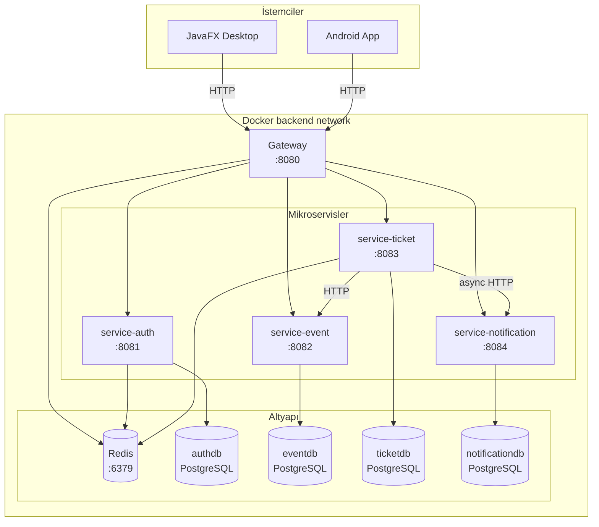
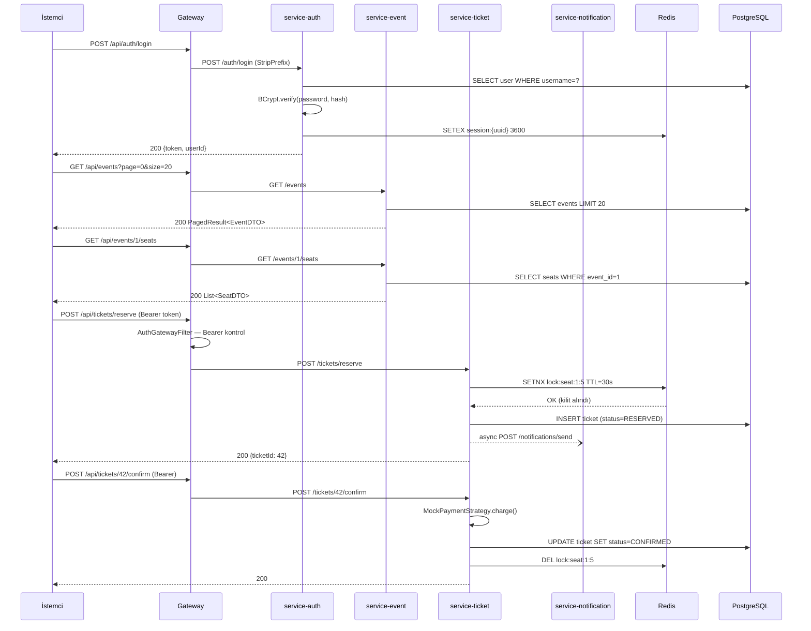
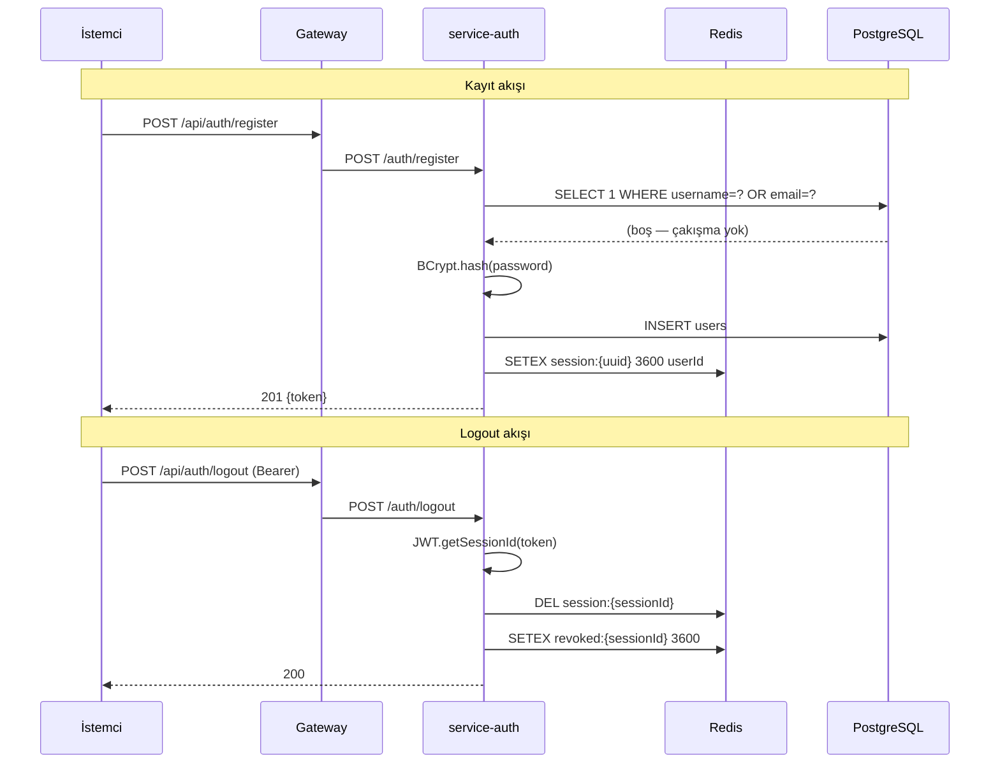
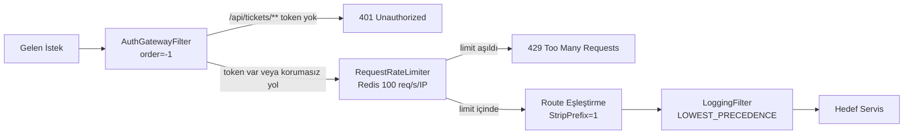

# Mimari Diyagramlar

## Component Diagram

```mermaid
graph TD
    subgraph clients["İstemciler"]
        FX[JavaFX Desktop]
        AND[Android App]
    end

    subgraph docker["Docker backend network"]
        GW[Gateway\n:8080]

        subgraph services["Mikroservisler"]
            AUTH[service-auth\n:8081]
            EVENT[service-event\n:8082]
            TICKET[service-ticket\n:8083]
            NOTIF[service-notification\n:8084]
        end

        subgraph infra["Altyapı"]
            REDIS[(Redis\n:6379)]
            PGA[(authdb\nPostgreSQL)]
            PGE[(eventdb\nPostgreSQL)]
            PGT[(ticketdb\nPostgreSQL)]
            PGN[(notificationdb\nPostgreSQL)]
        end
    end

    FX -->|HTTP| GW
    AND -->|HTTP| GW
    GW --> AUTH
    GW --> EVENT
    GW --> TICKET
    GW --> NOTIF
    GW --> REDIS
    AUTH --> PGA
    AUTH --> REDIS
    EVENT --> PGE
    TICKET --> PGT
    TICKET --> REDIS
    TICKET -->|async HTTP| NOTIF
    TICKET -->|HTTP| EVENT
    NOTIF --> PGN
```

---

## Rezervasyon Sequence Diagram

```mermaid
sequenceDiagram
    participant C as İstemci
    participant G as Gateway
    participant A as service-auth
    participant E as service-event
    participant T as service-ticket
    participant N as service-notification
    participant R as Redis
    participant DB as PostgreSQL

    C->>G: POST /api/auth/login
    G->>A: POST /auth/login (StripPrefix)
    A->>DB: SELECT user WHERE username=?
    A->>A: BCrypt.verify(password, hash)
    A->>R: SETEX session:{uuid} 3600
    A-->>C: 200 {token, userId}

    C->>G: GET /api/events?page=0&size=20
    G->>E: GET /events
    E->>DB: SELECT events LIMIT 20
    E-->>C: 200 PagedResult<EventDTO>

    C->>G: GET /api/events/1/seats
    G->>E: GET /events/1/seats
    E->>DB: SELECT seats WHERE event_id=1
    E-->>C: 200 List<SeatDTO>

    C->>G: POST /api/tickets/reserve (Bearer token)
    G->>G: AuthGatewayFilter — Bearer kontrol
    G->>T: POST /tickets/reserve
    T->>R: SETNX lock:seat:1:5 TTL=30s
    R-->>T: OK (kilit alındı)
    T->>DB: INSERT ticket (status=RESERVED)
    T--)N: async POST /notifications/send
    T-->>C: 200 {ticketId: 42}

    C->>G: POST /api/tickets/42/confirm (Bearer)
    G->>T: POST /tickets/42/confirm
    T->>T: MockPaymentStrategy.charge()
    T->>DB: UPDATE ticket SET status=CONFIRMED
    T->>R: DEL lock:seat:1:5
    T-->>C: 200
```

---

## Auth Sequence Diagram

```mermaid
sequenceDiagram
    participant C as İstemci
    participant G as Gateway
    participant A as service-auth
    participant R as Redis
    participant DB as PostgreSQL

    Note over C,DB: Kayıt akışı
    C->>G: POST /api/auth/register
    G->>A: POST /auth/register
    A->>DB: SELECT 1 WHERE username=? OR email=?
    DB-->>A: (boş — çakışma yok)
    A->>A: BCrypt.hash(password)
    A->>DB: INSERT users
    A->>R: SETEX session:{uuid} 3600 userId
    A-->>C: 201 {token}

    Note over C,DB: Logout akışı
    C->>G: POST /api/auth/logout (Bearer)
    G->>A: POST /auth/logout
    A->>A: JWT.getSessionId(token)
    A->>R: DEL session:{sessionId}
    A->>R: SETEX revoked:{sessionId} 3600
    A-->>C: 200
```

---

## Gateway Filter Zinciri

```mermaid
flowchart LR
    REQ[Gelen İstek] --> AF[AuthGatewayFilter\norder=-1]
    AF -->|/api/tickets/** token yok| R401[401 Unauthorized]
    AF -->|token var veya korumasız yol| RL[RequestRateLimiter\nRedis 100 req/s/IP]
    RL -->|limit aşıldı| R429[429 Too Many Requests]
    RL -->|limit içinde| ROUTE[Route Eşleştirme\nStripPrefix=1]
    ROUTE --> LOG[LoggingFilter\nLOWEST_PRECEDENCE]
    LOG --> SVC[Hedef Servis]
```
